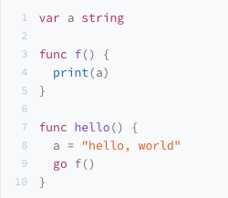
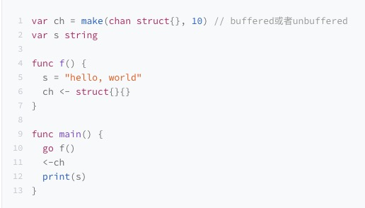
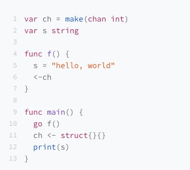
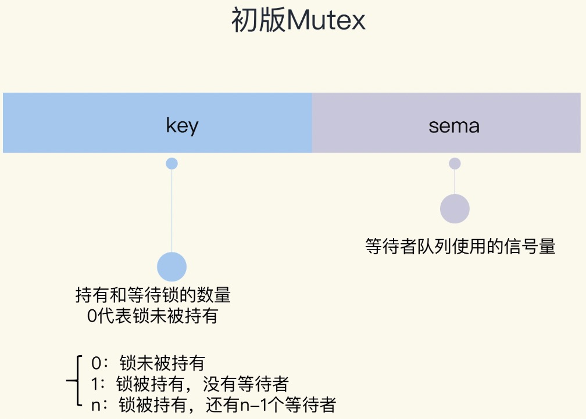
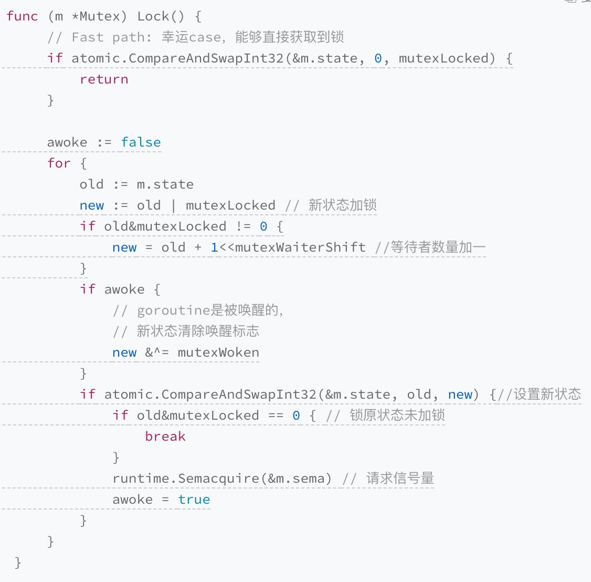
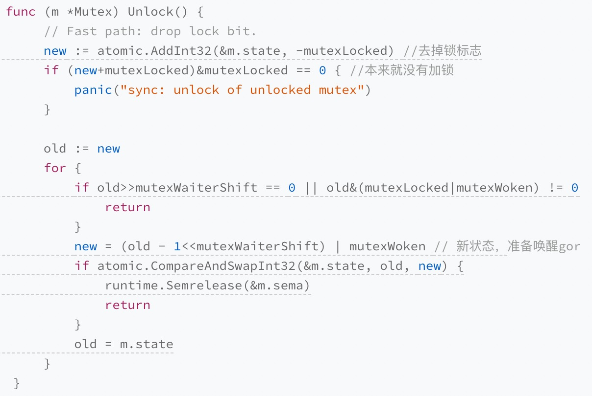
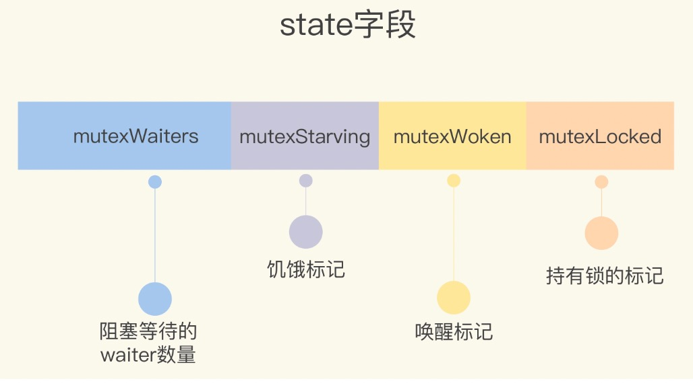
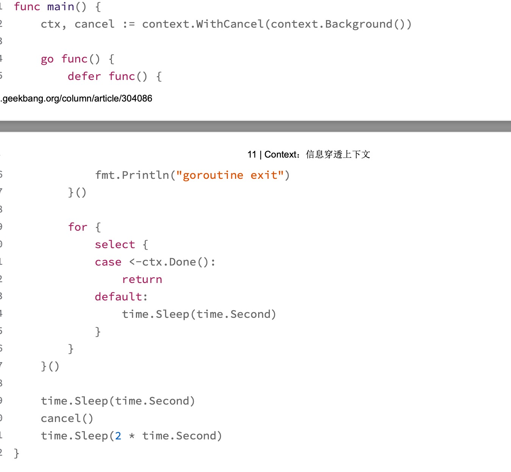

# 一、Go 内存模型
Go内存模型描述的是并发环境中多 goroutine 读相同变量的时候，变量的可见性条件。具体点说，就是指，在什么条件下，
goroutine 在读取一个变量的值的时候，能够看到其它 goroutine 对这个变量进行的写的结果。

由于CPU指令重排和多级Cache的存在，保证多核访问同一个变量变得非常复杂。毕竟，不同CPU架构的处理方式是不一样的，再加上编译器的优化也可能对指令进行重排，
所以编程语言需要一个规范，来明确多线程同时访问同一个变量的可见性和顺序。在编程语言中，这个规范叫做内存模型。

定义内存模型的目的：
1. 向广大的程序员提供一种保证，以便他们在做设计和开发程序时，面对同一个数据同时被多个goroutine访问的情况，可以做一些串行化访问的控制。
2. 允许编译器和硬件对程序做一些优化。主要是为编译器开发者提供的保证，这样可以方便他们对Go的编译器做优化

程序在运行的时候，两个操作的顺序可能得不到保证，那该怎么办？

Go内存模型中很重要的概念：happens-before，用来描述两个操作的顺序关系的。如果某些操作能提供happens-before关系，那么，我们就可以100%保证他们之间的顺序。

**happens-before**

在一个 goroutine 内部，程序的执行顺序和它们的代码指定的顺序是一样的，即使编译器 或者 CPU 重排了读写顺序，从行为上来看，也和代码指定的顺序一样。

对于另一个goroutine来说，就需要happens-before关系来保证了，如果两个action(read或者write）有明确的happens-before关系，就可以确定它们之间的执行顺序（或者行为表现上的顺序）。

通过happens-before定义**两个事件（读、写action）的顺序**：
1. 如果事件1 happens-before事件2，那么我们就可以说事件2在事件1之后发生（happens-after）。
2. 如果事件1不是happens-before事件2， 也不happens-after事件2，那么我们就可以说事件1和事件2是同时发生的。

我们要保证 r 绝对能观察 到 w 操作的结果，那么就需要同时满足两个条件:
1. w happens before r;
2. 其它对 v 的写操作(w2、w3、w4, ...) 要么 happens before w，要么 happens after r，绝对不会和 w、r 同时发生，或者是在它们之间发生。

**单个goroutine的happens-before关系**

在单个goroutine内部，happens-before的关系和代码编写的顺序是一致的。


除了单个 goroutine 内部提供的 happens-before 保证，Go 语言中还提供了一些其它的 happens-before 关系的保证：
1. init 函数
  - 应用程序的初始化是在单一的 goroutine 执行的。如果包 p 导入了包 q，那么，q 的 init 函数的执行一定 happens before p 的任何初始化代码。
  - main 函数一定在导入的包的 init 函数之后执行。
  - 同一个包下可以有多个init函数，但每个文件最多只能有一个init函数，多个init函数按照它们的文件名顺序逐个初始化。

2. goroutine
  - 启动 goroutine 的 go 语句的执行，一定 happens before 此 goroutine 内的代码执行。 在下面的例子中，第8行a的赋值和第9行是在同一个go中，所以第8行肯定happens-before第9行，又由于第9行子goroutine的启动happens-before第4行的输出，那么第8行happens-before第4行。即，一定会打印出"hello world"。
    
  - goroutine 退出的时候，是没有任何 happens- before 保证的

3. Channel 
  - 往 Channel 中的发送操作，happens-before 从该 Channel 接收相应数 据的动作完成之前。下面代码中一定会打印"hello world"
    
  - close 一个 Channel 的调用，肯定 happens before 从关闭的 Channel 中读取出一个零值。
  - 对于 unbuffered 的 Channel，也就是容量是 0 的 Channel，从此 Channel 中读取数据的调用一定 happens before 往此 Channel 发送数据的调用完成。下面代码中一定会打印"hello world"
    
  - 如果 Channel 的容量是 m(m>0)，那么，第 n 个 receive 一定 happens before 第 n+m 个 send 的完成


我们要保证 r 绝对能观察 到 w 操作的结果，那么就需要同时满足两个条件:
1. w happens before r;
2. 其它对 v 的写操作(w2、w3、w4, ...) 要么 happens before w，要么 happens after r，绝对不会和 w、r 同时发生，或者是在它们之间发生。
除了单个 goroutine 内部提供的 happens-before 保证，Go 语言中还提供了一些其它的 happens-before 关系的保证。


# 二、基础并发原语

## 1）Mutex

Mutex不需要额外的初始化，直接声明变量即可，如果嵌入的 struct 有多个字段，我们一般会把 Mutex 放在要控制的字段上面，然后使用空格把字段分隔开来。

> 同步机制实现基础

1. CAS(Compare And Swap)和原子运算。
2. 信号量sema
   按照runtime/sema.go中的注释：
   Think of them as a way to implement sleep and wakeup

Golang中的sema，提供了休眠和唤醒Goroutine的功能。

1. semacquire函数首先检查信号量是否为0：如果大于0，让信号量减一，返回；
   如果等于0，就调用goparkunlock函数，把当前Goroutine放入该sema的等待队列，并把他设为等待状态。
2. semrelease函数首先让信号量加一，然后检查是否有正在等待的Goroutine： 如果没有，直接返回；如果有，调用goready函数唤醒一个Goroutine。

> Mutex实现

### 1.1 初版Mutex

使用一个 flag 来表示锁是否被持有，实现比较简单：




初版的 Mutex 利用 CAS 原子操作，对 key 这个标志量进行设置。key 不仅仅标识了锁是否被 goroutine 所持有，还记录了当前持有和等待获取锁的
goroutine 的数量。

如果还有等待此锁的其它 goroutine，那么，它会调用 semrelease 方法（第 34 行），利用信号量唤醒等待锁的其它 goroutine 中的一个。

> 不足：性能不是最优的

请求锁的 goroutine 会排队等待获取互斥锁。虽然这貌似很公平，但是从性能上来看，却不是最优的。
因为如果我们能够把锁交给正在占用 CPU 时间片的 goroutine 的话，那就不需要做上下文的切换，在高并发的情况下，可能会有更好的性能。

### 1.2 给新人机会 （第二版Mutex）

Mutex 结构体还是包含两个字段，但是第一个字段已经改成了 state，它的含义也不一样了。

```go
type Mutex struct {
    state int32
    sema  uint32
}


const (
    mutexLocked = 1 << iota // mutex is locked
    mutexWoken
    mutexWaiterShift = iota
)
```
第一位（最小的一位）来表示这个锁是否被持有，第二位代表是否有唤醒的 goroutine，剩余的位数代表的是等待此锁的 goroutine 数


想要获取锁的 goroutine 没有机会获取到锁，就会进行休眠，但是在锁释放唤醒之后，它并不能像先前一样直接获取到锁，还是要和正在请求锁的 goroutine 进行竞争。
这会给后来请求锁的 goroutine 一个机会，也让 CPU 中正在执行的 goroutine 有更多的机会获取到锁，在一定程度上提高了程序的性能。





相对于初版的设计，这次的改动主要就是，新来的 goroutine 也有机会先获取到锁，甚至一个 goroutine 可能连续获取到锁，打破了先来先得的逻辑。但是，代码复杂度也显而易见。

> 不足：性能还有优化空间

虽然这一版的 Mutex 已经给新来请求锁的 goroutine 一些机会，让它参与竞争，没有空闲的锁或者竞争失败才加入到等待队列中。但是其实还可以进一步优化

### 1.3 多给些机会
新来的 goroutine 或者是被唤醒的 goroutine 首次获取不到锁，它们就会通过自旋的方式，尝试检查锁是否被释放。在尝试一定的自旋次数后，再执行原来的逻辑。

>不足：导致饥饿

因为新来的 goroutine 也参与竞争，有可能每次都会被新来的 goroutine 抢到获取锁的机会，在极端情况下，等待中的 goroutine 可能会一直获取不到锁，这就是饥饿问题。

### 1.4 解决饥饿
Go 1.9 中 Mutex 增加了饥饿模式，让锁变得更公平，不公平的等待时间限制在 1 毫秒。 一旦等待者等待的时间超过了这个阈值，Mutex 的处理就有可能进入饥饿模式，优先让等待者先获取到锁



**正常模式**

waiter 都是进入先入先出队列，被唤醒的 waiter 并不会直接持有锁，而是要和新来的 goroutine 进行竞争。新来的 goroutine 有先天的优势，它们正在 CPU 中运行，可能它们的数量还不少，所以，在高并发情况下，被唤醒的 waiter 可能比较悲剧地获取不到锁，这时，它会被插入到队列的前面。如果 waiter 获取不到锁的时间超过阈值 1 毫秒，那么，这个 Mutex 就进入到了饥饿模式。

**饥饿模式**

新来的 goroutine 不会尝试获取锁，即使看起来锁没有被持有，它也不会去抢，也不会 spin，它会乖乖地加入到等待队列的尾部。

如果拥有 Mutex 的 waiter 发现下面两种情况的其中之一，它就会把这个 Mutex 转换成正常模式:
1. 此 waiter 已经是队列中的最后一个 waiter 了，没有其它的等待锁的 goroutine 了；
2.   此 waiter 的等待时间小于 1 毫秒。

正常模式拥有更好的性能, 饥饿模式是对公平性和性能的一种平衡。

**常见的错误场景**:
1. Lock/Unlock 不是成对出现
2. Copy 已使用的 Mutex
3. 重入(Mutex 不是可重入的锁)
4. 死锁


## 2）RWMutex
RWMutex 在某一时刻只能由任意数量的 reader 持有，或者是只被单个的 writer 持有。

如果你遇到可以明确区分 reader 和 writer goroutine 的场景，且有大量的并发读、少量的并发写，并且有强烈的性能需求，你就可以考虑使用读写锁 RWMutex 替换 Mutex。
```go
type RWMutex struct {
	w           Mutex  // held if there are pending writers
	writerSem   uint32 // semaphore for writers to wait for completing readers
	readerSem   uint32 // semaphore for readers to wait for completing writers
	readerCount int32  // number of pending readers
	readerWait  int32  // number of departing readers
}

func (rw *RWMutex) Unlock() {
if race.Enabled {
_ = rw.w.state
race.Release(unsafe.Pointer(&rw.readerSem))
race.Disable()
}

// Announce to readers there is no active writer.
r := atomic.AddInt32(&rw.readerCount, rwmutexMaxReaders)
if r >= rwmutexMaxReaders {
race.Enable()
fatal("sync: Unlock of unlocked RWMutex")
}
// Unblock blocked readers, if any.
for i := 0; i < int(r); i++ {
runtime_Semrelease(&rw.readerSem, false, 0)
}
// Allow other writers to proceed.
rw.w.Unlock()
if race.Enabled {
race.Enable()
}
}
```
采用Write-preferring 方案。一个正在阻塞的 Lock 调用会排除新的 reader 请求到锁。
从上面代码可以看到，唤醒等待读锁的方式，就是通过循环唤醒信号量上等待的goroutines。

## 3) Cond
**基本用法**
1. Signal：唤醒一个等待此Cond的goroutine
2. Broadcast：唤醒所有等待此Cond的goroutine
3. Wait：把caller放入Cond的等待队列中并阻塞，直到被Signal或者Broadcast的方法从队列中唤醒

**常见错误**: 调用wait的时候没有加锁

Cond有3点特性，是Channel无法替代的:
1. Cond与一个Locker关联，可以利用这个Locker对相关的依赖条件更改提供保护
2. Cond可以同时支持Signal和Broadcast，而Channel只能同时支持其中一种
3. Cond的BroadCast方法可以被重复调用

## 4) Once
Once 可以用来执行且仅仅执行一次动作，常常用于单例对象的初始化场景。

实现原理：double-checking
```go
func (o *Once) Do(f func()) {
	// Note: Here is an incorrect implementation of Do:
	//
	//	if atomic.CompareAndSwapUint32(&o.done, 0, 1) {
	//		f()
	//	}
	//
	// Do guarantees that when it returns, f has finished.
	// This implementation would not implement that guarantee:
	// given two simultaneous calls, the winner of the cas would
	// call f, and the second would return immediately, without
	// waiting for the first's call to f to complete.
	// This is why the slow path falls back to a mutex, and why
	// the atomic.StoreUint32 must be delayed until after f returns.

	if atomic.LoadUint32(&o.done) == 0 {
		// Outlined slow-path to allow inlining of the fast-path.
		o.doSlow(f)
	}
}

func (o *Once) doSlow(f func()) {
	o.m.Lock()
	defer o.m.Unlock()
	if o.done == 0 {
		defer atomic.StoreUint32(&o.done, 1)
		f()
	}
}
```

**常见错误**
1. 死锁
   Do 方法会执行一次 f，但是如果 f 中再次调用这个 Once 的 Do 方法的话， 就会导致死锁的情况出现。这还不是无限递归的情况，而是的的确确的 Lock 的递归调用导 致的死锁。
2. **未初始化**
   如果 f 方法执行的时候 panic，或者 f 执行初始化资源的时候失败了，这个时候，Once 还 是会认为初次执行已经成功了，即使再次调用 Do 方法，也不会再次执行 f。

**怎么解决初始化未完成的问题?**

自己实现一个类似 Once 的并发原语，既可以返 回当前调用 Do 方法是否正确完成，还可以在初始化失败后调用 Do 方法再次尝试初始化，直到初始化成功才不再初始化了。

## 5）sync.Map
>Go 内建的 map 类型

使用 struct 类型做 key 其实是有坑的，因为如果 struct 的某 个字段值修改了，查询 map 时无法获取它 add 进去的值。
 
如果要使用 struct 作为 key，我们要保证 struct 对象在逻辑上是不可变 的，这样才会保证 map 的逻辑没有问题。

map 是无序的。 

**常见错误**：
1. 未初始化，和 slice 或者 Mutex、RWmutex 等 struct 类型不同，map 对象必须在使用之前初始化。 如果不初始化就直接赋值的话，会出现 panic 异常
2. 并发读写。并发读写的时候运行时会有检查， 遇到并发问题就会导致 panic。

**如何实现线程安全的map？**
1. 加读写锁：扩展map，支持并发读写
2. 分片加锁：更高效的并发map。 (GetShard是一个关键的方法，能够根据key计算出分片索引)

**sync.Map的使用场景**：
1. 只会增长的缓存系统中，一个 key 只写入一次而被读很多次;
2. 多个 goroutine 为不相交的键集读、写和重写键值对。

很少使用。可以把 sync.Map 看成一个生产环境中很少使用 的同步原语。

**sync.Map的优化点有哪些？**
1. 空间换时间。通过冗余的两个数据结构(只读的 read 字段、可写的 dirty)，来减少加锁对性能的影响。对只读字段(read)的操作不需要加锁
2. 优先从 read 字段读取、更新、删除
3. 动态调整。miss 次数多了之后，将 dirty 数据提升为 read，避免总是从 dirty 中加锁读 取
4. double-checking。加锁之后先还要再检查 read 字段，确定真的不存在才操作 dirty 字 段。
5. 延迟删除。删除一个键值只是打标记，只有在提升 dirty 字段为 read 字段的时候才清理 删除的数据。

## 6）atomic
atomic的提供的方法：
1. Add、CAS (CompareAndSwap)、Swap、Load、Store
2. Value 类型: 可以原子地存取对象类型

第三方库的扩展:
1. atomic 的 API 让熟悉面向对象编程的程序员不爽。 可以用uber-go/atomic
2. 使用 atomic 实现 Lock-Free queue

## 7）WaitGroup
基本用法
```go
func (wg *WaitGroup) Add(delta int)
func (wg *WaitGroup) Done()
func (wg *WaitGroup) Wait()
```
**实现原理**
1. noCopy 的辅助字段，主要就是辅助 vet 工具检查是否通过 copy 赋值这个 WaitGroup 实例。 
    vet 工具的 copylocks 检测器有这么一个功能：检测带锁类型（如 sync.Mutex） 的错误复制使用，这种不当的复制，会引发死锁。
   ```go
   type WaitGroup struct {
       noCopy noCopy
   
       // 64-bit value: high 32 bits are counter, low 32 bits are waiter count.
       // 64-bit atomic operations require 64-bit alignment, but 32-bit
       // compilers only guarantee that 64-bit fields are 32-bit aligned.
       // For this reason on 32 bit architectures we need to check in state()
       // if state1 is aligned or not, and dynamically "swap" the field order if
       // needed.
       state1 uint64
       state2 uint32
   }
   
   type noCopy struct{}
   
   // Lock is a no-op used by -copylocks checker from `go vet`.
   func (*noCopy) Lock()   {}
   func (*noCopy) Unlock() {}
   ```
2. state1，一个具有复合意义的字段，包含 WaitGroup 的计数、阻塞在检查点的 waiter 数和信号量。

**常见错误**：
1. 计数器为负值，panic
2. 前一个 Wait 还没结束就重用 WaitGroup， panic

## 8）Channel
Channel分为只能接收、只能发送、既可以接收又可以发送三种类型, 按是否有缓存可分为buffered chan和unbuffered chan。
nil 是 chan 的零值，是一种特殊的 chan，对值是 nil 的 chan 的发送接收调用者总是会阻塞。

close 会把 chan 关闭掉，cap 返回 chan 的容量，len 返回 chan 中缓存的还未被取走的元素数量。

**应用场景**
1.  数据交流：当作并发的 buffer 或者 queue，解决生产者 - 消费者问题。多个 goroutine 可以并发当作生产者(Producer)和消费者(Consumer)。
2. 数据传递:一个 goroutine 将数据交给另一个 goroutine，相当于把数据的拥有权 (引 用) 托付出去。
3. 信号通知:一个 goroutine 可以将信号 (closing、closed、data ready 等) 传递给另一 个或者另一组 goroutine
4. 任务编排:让一组 goroutine 按照一定的顺序并发或者串行的执行，这就是编排的 功能。
5. 锁：利用 Channel 也可以实现互斥锁的机制。

**常见错误**：
1.  panic
   - close 为 nil 的 chan
   - send 已经 close 的 chan
   - close 已经 close 的 chan
2. goroutine 泄漏
   超时导致未读，结果就是子 goroutine 就阻塞在第 7 行永远结束不了，进而导致 goroutine 泄漏。unbuffered chan goroutine 泄漏的问题.
   ```go
       ch := make(chan bool)
       go func() {
           //模拟业务耗时
           time.Sleep(timeout + time.Second)
           ch <- true
           fmt.Println("exit go")
       }()
       select {
       case result := <-ch:
           return result
       case <-time.After(timeout):
           return false
       }
   ```
   解决这个 Bug 的办法很简单，就是将 unbuffered chan 改成容量为 1 的 chan，这样第 7 行就不会被阻塞了。

**Channel最佳实践**:
Channel 并不是处理 并发问题的“银弹”，有时候使用并发原语更简单，而且不容易出错。
1. 共享资源的并发访问使用传统并发原语;
2. 复杂的任务编排和消息传递使用 Channel;
3. 消息通知机制使用 Channel，除非只想 signal 一个 goroutine，才使用 Cond;
4. 简单等待所有任务的完成用 WaitGroup，也有 Channel 的推崇者用 Channel，都可 以;
5. 需要和 Select 语句结合，使用 Channel;
6. 需要和超时配合时，使用 Channel 和 Context。

## 9）Context
上下文(Context)是指，在 API 之间或者方法调用之间，所传递的除了业务参数之外的额外信息。

**接口定义**
```go
type Context interface {
    Deadline() (deadline time.Time, ok bool)
    Done() <-chan struct{}
    Err() error
    Value(key interface{}) interface{} 
}
```
- Deadline 方法会返回这个 Context 被取消的截止日期。如果没有设置截止日期，ok 的值 是 false。后续每次调用这个对象的 Deadline 方法时，都会返回和第一次调用相同的结 果。
- Done 方法返回一个 Channel 对象。在 Context 被取消时，此 Channel 会被 close。
- 如果 Done 没有被 close，Err 方法返回 nil;如果 Done 被 close，Err 方法会返回 Done 被 close 的原因。
- Value 返回此 ctx 中和指定的 key 相关联的 value。

**基本使用方法**
1. 创建常用的顶层 Context
   - context.Background():返回一个非 nil 的、空的 Context，没有任何值，不会被 cancel，不会超时，没有截止日期。一般用在主函数、初始化、测试以及创建根 Context 的时候。
   - context.TODO():返回一个非 nil 的、空的 Context，没有任何值，不会被 cancel，不会超时，没有截止日期。当你不清楚是否该用Context，或者目前还不知道要传递一些什么上下文信息的时候，就可以使用这个方法
   - 可以直接使用context.Background,事实上，它们两个底层的实现 是一模一样的
2. 创建特殊用途 Context 
   - context.WithValue(parent Context, key, val any) Context: 基于 parent Context 生成一个新的 Context，保存了一个 key-value 键值对，常常用来传递上下文。其实创建了一个类型为 valueCtx 的 Context，它持有一个 key-value 键值对，还持有 parent 的 Context，覆盖了 Value 方法，优先 从自己的存储中检查这个 key，不存在的话会从 parent 中继续检查。
   - context.WithCancel(parent Context) (ctx Context, cancel CancelFunc): 在一些需要主动取消长时间的任务时，创建这种类型的 Context，然后把这个 Context 传给长时间执行任务的 goroutine。当这个 cancelCtx 的 cancel 函数被调用的时候，或者 parent 的 Done 被 close 的时候， 这个 cancelCtx 的 Done 才会被 close。cancel 是向下传递的，如果一个 WithCancel 生成的 Context 被 cancel 时，如果它的子 Context(也有可能是孙，或者更低，依赖子的类型)也是 cancelCtx 类型的，就会被 cancel，但是不会向上传递。parent Context 不会因为子 Context 被 cancel 而 cancel。
   - context.WithDeadline(parent Context, d time.Time) (Context, CancelFunc):会返回一个 parent 的副本，并且设置了一个不晚于参数 d 的截止时间，类 型为 timerCtx(或者是 cancelCtx)。如果它的截止时间晚于 parent 的截止时间，那么就以 parent 的截止时间为准，并返回一 个类型为 cancelCtx 的 Context，因为 parent 的截止时间到了，就会取消这个 cancelCtx。
     - timerCtx 的 Done 被 Close 掉，主要是由下面的某个事件触发的:截止时间到了;cancel 函数被调用;parent 的 Done 被 close。
   - context.WithTimeout(parent Context, timeout time.Duration) (Context, CancelFunc):WithTimeout 其实是和 WithDeadline 一样，只不过一个参数是超时时间，一个参数是截 止时间。超时时间加上当前时间，其实就是截止时间

**使用场景**
1. 经常使用 Context 来取消一个 goroutine 的运行，这是 Context 最常用的场景之 一，Context 也被称为 goroutine 生命周期范围(goroutine-scoped)的 Context，把 Context 传递给 goroutine。但是goroutine 需要尝试检查 Context 的 Done 是否关闭 了:
   
2.  Context 实现一个带超时功能的调用，比如访问远程的一个微服务
3. 在 Context 被 cancel 的 时候，你能关闭和服务器的连接，中断和数据库服务器的通讯、停止对本地文件的读写， 那么，这样的超时处理，同时能减少对服务调用的压力，但是这依赖于你对超时的底层处理机制。

## 10）Pool


# Q&A
**如何实现可重入锁?**
1. 方案一：通过 hacker 的方式获取到 goroutine id，记录下获取锁的 goroutine id，它可以实现 Locker 接口。
2. 方案二：调用 Lock/Unlock 方法时，由 goroutine 提供一个 token，用来标识它自己，而不是我们通过 hacker 的方式获取到 goroutine id，但是，这样一来，就不满足 Locker 接口了。

尽管拥有者可以多次调用 Lock，但是也必须调用相同次数的 Unlock，这样才能把锁释放掉。这是一个合理的设计，可以保证 Lock 和 Unlock 一一对应。


**如何获取锁等待者的数量等指标？**

锁是性能下降的“罪魁祸首”之一，所以，有效地降低锁的竞争，就能够很好地提高性能。因此，监控关键互斥锁上等待的 goroutine 的数量，是我们分析锁竞争的激烈程度的一个重要指标。

Mutex 结构中的 state 字段有很多个含义，通过 state 字段，你可以知道锁是否已经被某个 goroutine 持有、当前是否处于饥饿状态、是否有等待的 goroutine 被唤醒、等待者的数量等信息。但是，state 这个字段并没有暴露出来。
可以通过 unsafe 的方式获取mutex地址，从而获取state的字段值。


