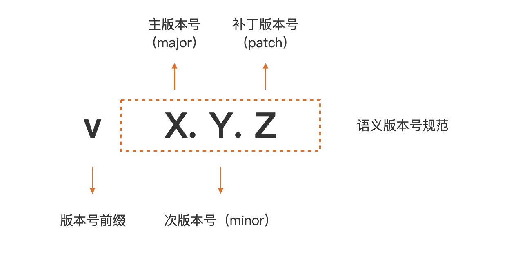
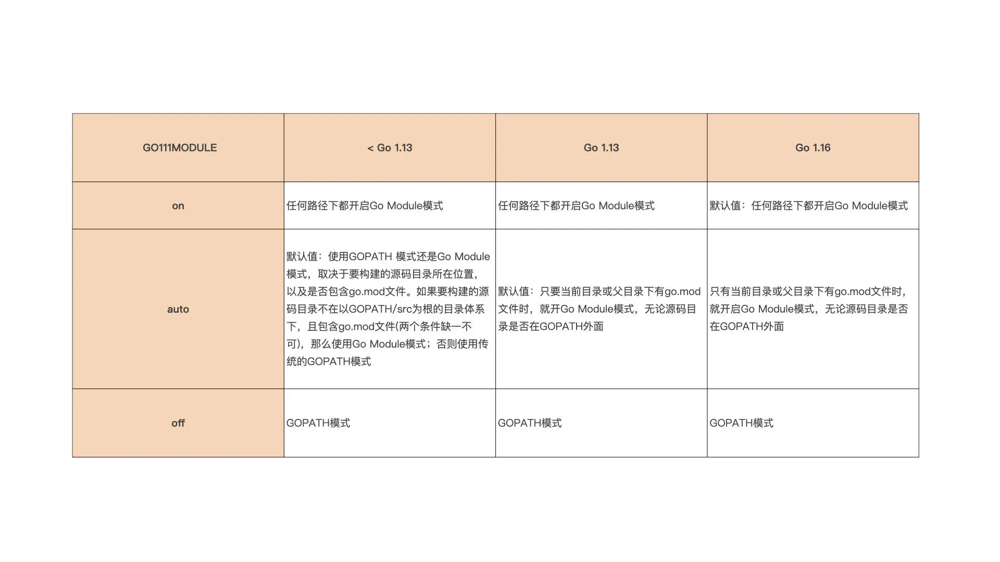

# GOROOT与GOPATH
GOROOT： Go语言的安装路径。
也就是说GOROOT存放的Golang语言的内建程序库的所在位置，通常安装完成后，电脑就会设置好GOROOT路径，当你开发Golang程序，import内建的程序库的时候，
并不需要额外安装、下载，当程序运行后，也会先去GOROOT路径下寻找相对应的程序库来运行。

GOPATH：我们自己定义的工作空间，可以包含若干工作区目录的路径（eg：export GOPATH=/usr/local/projects:/home/alik/go), 每个目录都代表Go语言的一个工作区（workspace）。

# go构建模式的前世今生
Go 程序由 Go 包组合而成的，Go 程序的构建过程就是确定包版本、编译包以及将编译后得到的目标文件链接在一起的过程。
Go 语言的构建模式历经了三个迭代和演化过程，分别是最初期的 GOPATH、1.5 版本的 Vendor 机制，以及现在的 Go Module。

# GOPATH
Go 语言在首次开源时，就内置了一种名为 GOPATH 的构建模式。在这种构建模式下，Go 编译器可以在本地 GOPATH 环境变量配置的路径下，搜寻 Go 程序依赖的第三方包。如果存在，就使用这个本地包进行编译；如果**不存在**，就会报编译错误。
这也意味着你得提前手动使用go get将各个依赖包下载到本地GOPATH中。


### Go 编译器在 GOPATH 构建模式下，究竟怎么在 GOPATH 配置的路径下搜寻第三方依赖包呢?
先假定 Go 程序导入了 github.com/user/repo 这个包，我们也同时假定当前 GOPATH 环境变量配置的值为：
```shell
export GOPATH=/usr/local/projects:/home/alik/go
```
那么在GOPATH 构建模式下，Go 编译器在编译 Go 程序时，就会在下面两个路径下搜索第三方依赖包是否存在：
```shell
/usr/local/projects/src/github.com/user/repo
/home/alik/go/src/github.com/user/repo
```
如果你没有显式设置 GOPATH 环境变量，Go 会将 GOPATH 设置为默认值，不同操作系统下默认值的路径不同，在 macOS 或 Linux 上，它的默认值是 $HOME/go。


### 如何解决没有在本地找到程序的第三方依赖包的问题
可以通过 **go get** 命令将本地缺失的第三方依赖包下载到本地，比如：
```shell
go get github.com/sirupsen/logrus
```
go get 命令，不仅能将 logrus 包下载到 GOPATH 环境变量配置的目录下，它还会检查 logrus 的依赖包在本地是否存在，如果不存在，go get 也会一并将它们下载到本地。

不过，go get 下载的包只是那个时刻各个依赖包的**最新主线版本**，这样会给后续 Go 程序的构建带来一些问题。比如，依赖包持续演进，可能会导致不同开发者在不同时间获取和编译同一个 Go 包时，
得到不同的结果，也就是不能保证可重现的构建（Reproduceable Build）。又比如，如果依赖包引入了不兼容代码，程序将无法通过编译。
如果依赖包因引入新代码而无法正常通过编译，并且该依赖包的作者又没用及时修复这个问题，这种错误也会传导到你的程序，导致你的程序无法通过编译。

也就是说，**在 GOPATH 构建模式下，Go 编译器实质上并没有关注 Go 项目所依赖的第三方包的版本**。但 Go 开发者希望自己的 Go 项目所依赖的第三方包版本能受到自己的控制，而不是随意变化。
于是 Go 核心开发团队引入了 Vendor 机制试图解决上面的问题。

# vendor
  Go 在 1.5 版本中引入 vendor 机制。vendor 机制本质上就是在 Go 项目的某个特定目录下，将项目的所有依赖包缓存起来，这个特定目录名就是 vendor。

  Go 编译器会优先感知和使用 vendor 目录下缓存的第三方包版本，而不是 GOPATH 环境变量所配置的路径下的第三方包版本。这样，无论第三方依赖包自己如何变化，无论 GOPATH 环境变量所配置的路径下的第三方包是否存在、版本是什么，都不会影响到 Go 程序的构建。

  如果你将 vendor 目录和项目源码一样提交到代码仓库，那么其他开发者下载你的项目后，就可以实现可重现的构建。因此，如果使用 vendor 机制管理第三方依赖包，最佳实践就是将 vendor 一并提交到代码仓库中。

下面这个目录结构就是为上面的代码示例添加 vendor 目录后的结果：
```shell
.
├── main.go
└── vendor/
    ├── github.com/
    │   └── sirupsen/
    │       └── logrus/
    └── golang.org/
        └── x/
            └── sys/
                └── unix/
```
在添加完 vendor 后，我们重新编译 main.go，这个时候 Go 编译器就会在 vendor 目录下搜索程序依赖的 logrus 包以及后者依赖的 golang.org/x/sys/unix 包了。
这里你还要注意一点，要想开启 vendor 机制，你的 Go 项目必须位于 GOPATH 环境变量配置的某个路径的 src 目录下面。如果不满足这一路径要求，那么 Go 编译器是不会理会 Go 项目目录下的 vendor 目录的。

不过 vendor 机制虽然一定程度解决了 Go 程序可重现构建的问题，但对开发者来说，它的体验却不那么好。一方面，Go 项目必须放在 GOPATH 环境变量配置的路径下，庞大的 vendor 目录需要提交到代码仓库，不仅占用代码仓库空间，减慢仓库下载和更新的速度，而且还会干扰代码评审，对实施代码统计等开发者效能工具也有比较大影响。
另外，你还需要手工管理 vendor 下面的 Go 依赖包，包括项目依赖包的分析、版本的记录、依赖包获取和存放，等等，最让开发者头疼的就是这一点。

就在 Go 社区为包依赖管理焦虑并抱怨没有官方工具的时候，Go 核心团队基于社区实践的经验和教训，推出了 Go 官方的解决方案：Go Module。
# Go Module
从 Go 1.11 版本开始，除了 GOPATH 构建模式外，Go 又增加了一种 Go Module 构建模式。

一个 Go Module 是一个 Go 包的集合。module 是有版本的，所以 module 下的包也就有了版本属性。这个 module 与这些包会组成一个独立的版本单元，它们一起打版本、发布和分发。


在 Go Module 模式下，通常一个代码仓库对应一个 Go Module。一个 Go Module 的顶层目录下会放置一个 go.mod 文件，每个 go.mod 文件会定义唯一一个 module，也就是说 Go Module 与 go.mod 是一一对应的。
go.mod 文件所在的顶层目录也被称为 module 的根目录，module 根目录以及它子目录下的所有 Go 包均归属于这个 Go Module，这个 module 也被称为 main module。
### 创建一个 Go Module
将基于当前项目创建一个 Go Module，通常有如下几个步骤：
1. 通过 go mod init 创建 go.mod 文件，将当前项目变为一个 Go Module
2. 通过 go mod tidy 命令自动更新当前 module 的依赖信息
   对于一个处于初始状态的 module 而言，go mod tidy 分析了当前 main module 的所有源文件，找出了当前 main module 的所有第三方依赖，确定第三方依赖的版本，还下载了当前 main module 的直接依赖包（比如 logrus），以及相关间接依赖包（直接依赖包的依赖，比如上面的 golang.org/x/sys 等）。
3. 执行 go build，执行新 module 的构建

Go Module 还支持通过 Go Module 代理服务加速第三方依赖的下载。GOPROXY这个环境变量的默认值为“https: // proxy.golang.org,direct”，不过我们可以配置更适合于中国大陆地区的 Go Module 代理服务。

由 go mod tidy 下载的依赖 module 会被放置在本地的 module 缓存路径下，默认值为 $GOPATH[0]/pkg/mod，Go 1.15 及以后版本可以通过 GOMODCACHE 环境变量，自定义本地 module 的缓存路径。

执行 go mod tidy 后，我们示例 go.mod 的内容更新如下：
```shell
module github.com/bigwhite/module-mode

go 1.16

require github.com/sirupsen/logrus v1.8.1
```
执行 go mod tidy 自动分析和下载依赖项。
而且，执行完 go mod tidy 后，当前项目除了 go.mod 文件外，还多了一个新文件 go.sum, 这同样是由 go mod 相关命令维护的一个文件，它存放了特定版本 module 内容的哈希值。
这是 Go Module 的一个安全措施。当将来这里的某个 module 的特定版本被再次下载的时候，go 命令会使用 go.sum 文件中对应的哈希值，和新下载的内容的哈希值进行比对，只有哈希值比对一致才是合法的，这样可以确保你的项目所依赖的 module 内容，不会被恶意或意外篡改。因此，我推荐你把 go.mod 和 go.sum 两个文件与源码，一并提交到代码版本控制服务器上。


go build 命令会读取 go.mod 中的依赖及版本信息，并在本地 module 缓存路径下找到对应版本的依赖 module，执行编译和链接。如果顺利的话，我们会在当前目录下看到一个新生成的可执行文件，执行这个文件我们就能得到正确结果了。

# 深入 Go Module 构建模式
## Go Module 的语义导入版本机制
在上面的例子中，我们看到 go.mod 的 require 段中依赖的版本号，都符合 vX.Y.Z 的格式。在 Go Module 构建模式下，一个符合 Go Module 要求的版本号，由前缀 v 和一个满足语义版本规范的版本号组成。

你可以看看下面这张图，语义版本号分成 3 部分：主版本号（major）、次版本号（minor）和补丁版本号（patch）。例如上面的 logrus module 的版本号是 v1.8.1，这就表示它的主版本号为 1，次版本号为 8，补丁版本号为 1。



Go 命令和 go.mod 文件都使用上面这种符合语义版本规范的版本号，作为描述 Go Module 版本的标准形式。借助于语义版本规范，Go 命令可以确定同一 module 的两个版本发布的先后次序，而且可以确定它们**是否兼容**。
按照语义版本规范，主版本号不同的两个版本是相互不兼容的。而且，在主版本号相同的情况下，次版本号大都是向后兼容次版本号小的版本。补丁版本号也不影响兼容性。

而且，Go Module 规定：如果同一个包的新旧版本是兼容的，那么它们的包导入路径应该是相同的。怎么理解呢？我们来举个简单示例。我们就以 logrus 为例，它有很多发布版本，我们从中选出两个版本 v1.7.0 和 v1.8.1. 那么，我们就可以知道，如果一个项目依赖 logrus，无论它使用的是 v1.7.0 版本还是 v1.8.1 版本，它都可以使用下面的包导入语句导入 logrus 包：
```go
import "github.com/sirupsen/logrus"
```
假如在未来的某一天，logrus 的作者发布了 logrus v2.0.0 版本。那么根据语义版本规则，该版本的主版本号为 2，已经与 v1.7.0、v1.8.1 的主版本号不同了，那么 v2.0.0 与 v1.7.0、v1.8.1 就是不兼容的包版本。然后我们再按照 Go Module 的规定，如果一个项目依赖 logrus v2.0.0 版本，那么它的包导入路径就不能再与上面的导入方式相同了。那我们应该使用什么方式导入 logrus v2.0.0 版本呢？
Go Module 创新性地给出了一个方法：将包主版本号引入到包导入路径中，我们可以像下面这样导入 logrus v2.0.0 版本依赖包：
```go
import "github.com/sirupsen/logrus/v2"
```
这就是 Go 的“语义导入版本”机制，也就是说通过在包导入路径中引入主版本号的方式，来区别同一个包的不兼容版本，这样一来我们甚至可以同时依赖一个包的两个不兼容版本：
```go
import (
    "github.com/sirupsen/logrus"
    logv2 "github.com/sirupsen/logrus/v2"
)
```
### Go Module 的最小版本选择原则
依赖关系一旦复杂起来，比如像下图中展示的这样，Go 又是如何确定使用依赖包 C 的哪个版本的呢？


在这张图中，myproject 有两个直接依赖 A 和 B，A 和 B 有一个共同的依赖包 C，但 A 依赖 C 的 v1.1.0 版本，而 B 依赖的是 C 的 v1.3.0 版本，并且此时 C 包的最新发布版为 C v1.7.0。这个时候，Go 命令是如何为 myproject 选出间接依赖包 C 的版本呢？选出的究竟是 v1.7.0、v1.1.0 还是 v1.3.0 呢？你可以暂停一两分钟思考一下。

其实，当前存在的主流编程语言，以及 Go Module 出现之前的很多 Go 包依赖管理工具都会选择依赖项的“最新最大 (Latest Greatest) 版本”，对应到图中的例子，这个版本就是 v1.7.0。

Go 设计者另辟蹊径，在诸多兼容性版本间，他们不光要考虑最新最大的稳定与安全，还要尊重各个 module 的述求：A 明明说只要求 C v1.1.0，B 明明说只要求 C v1.3.0。**所以 Go 会在该项目依赖项的所有版本中，选出符合项目整体要求的“最小版本”。**
最小版本选择更容易实现可重现构建。试想一下，如果选择的是最大最新版本，那么针对同一份代码，其依赖包的最新最大版本在不同时刻可能是不同的，那么在不同时刻的构建，产生的最终文件就是不同的。

这个例子中，C v1.3.0 是符合项目整体要求的版本集合中的版本最小的那个，于是 Go 命令选择了 C v1.3.0，而不是最新最大的 C v1.7.0。并且，Go 团队认为“最小版本选择”为 Go 程序实现持久的和可重现的构建提供了最佳的方案。

### Go 各版本构建模式机制和切换



现在，Go 核心团队已经考虑在后续版本中彻底移除 GOPATH 构建模式，Go Module 构建模式将成为 Go 语言唯一的标准构建模式。
建议你从现在开始就彻底抛弃 GOPATH 构建模式，全面使用 Go Module 构建模式。

### 添加一个主版本号大于 1 的依赖
在前面的例子中，Go Module 的依赖的主版本号都是 1。根据我们上节课中学习的语义导入版本的规范，在 Go Module 构建模式下，当依赖的主版本号为 0 或 1 的时候，我们在 Go 源码中导入依赖包，不需要在包的导入路径上增加版本号，也就是：
```go
import github.com/user/repo/v0 等价于 import github.com/user/repo
import github.com/user/repo/v1 等价于 import github.com/user/repo
```
按照语义版本规范，如果我们要为项目引入主版本号大于 1 的依赖，比如 v2.0.0，那么由于这个版本与 v1、v0 开头的包版本都不兼容，我们在导入 v2.0.0 包时，不能再直接使用 github.com/user/repo，而要使用像下面代码中那样不同的包导入路径：
```go
import github.com/user/repo/v2/xxx
```
也就是说，如果我们要为 Go 项目添加主版本号大于 1 的依赖，我们就需要使用“语义导入版本”机制，在声明它的导入路径的基础上，加上版本号信息。

我们以“向 module-mode 项目添加 github.com/go-redis/redis 依赖包的 v7 版本”为例，看看添加步骤。
1. 首先，我们在源码中，以空导入的方式导入 v7 版本的 github.com/go-redis/redis 包：
    ```go
    package main
    
    import (
      _ "github.com/go-redis/redis/v7" // “_”为空导入
      "github.com/google/uuid"
      "github.com/sirupsen/logrus"
    )
    
    func main() {
      logrus.Println("hello, go module mode")
      logrus.Println(uuid.NewString())
    }
    ```
2. 接下来的步骤就与添加兼容依赖一样，我们通过 go get 获取 redis 的 v7 版本：
    ```go
    go get github.com/go-redis/redis/v7
    go: downloading github.com/go-redis/redis/v7 v7.4.1
    go: downloading github.com/go-redis/redis v6.15.9+incompatible
    go get: added github.com/go-redis/redis/v7 v7.4.1
    ```
   
### 特殊情况：使用vendor
vendor 机制虽然诞生于 GOPATH 构建模式主导的年代，但在 Go Module 构建模式下，它依旧被保留了下来，并且成为了 Go Module 构建机制的一个很好的补充。特别是在一些不方便访问外部网络，并且对 Go 应用构建性能敏感的环境，比如在一些内部的持续集成或持续交付环境（CI/CD）中，使用 vendor 机制可以实现与 Go Module 等价的构建。

和 GOPATH 构建模式不同，Go Module 构建模式下，我们再也无需手动维护 vendor 目录下的依赖包了，Go 提供了可以快速建立和更新 vendor 的命令，我们还是以前面的 module-mode 项目为例，通过下面命令为该项目建立 vendor：
```shell
$go mod vendor
$tree -LF 2 vendor
vendor
├── github.com/
│   ├── google/
│   ├── magefile/
│   └── sirupsen/
├── golang.org/
│   └── x/
└── modules.txt
```
我们看到，go mod vendor 命令在 vendor 目录下，创建了一份这个项目的依赖包的副本，并且通过 vendor/modules.txt 记录了 vendor 下的 module 以及版本。如果我们要基于 vendor 构建，而不是基于本地缓存的 Go Module 构建，我们需要在 go build 后面加上 -mod=vendor 参数。

在 Go 1.14 及以后版本中，如果 Go 项目的顶层目录下存在 vendor 目录，那么 go build 默认也会优先基于 vendor 构建，除非你给 go build 传入 -mod=mod 的参数。


# Q&A
使用go module模式后，通过go get下载的第三方库会保存在哪？

只要开启来go modules功能，go get 就不会像以前一样放置在GOPATH/src下，而是会放在$GOPATH[0]/pkg/mod裡面，也就是go module存放第三方库的位置。

如何升级 / 降级依赖的版本？

基于初始状态执行的 go mod tidy 命令，帮我们选择了 logrus 的最新发布版本 v1.8.1。如果你觉得这个版本存在某些问题，想将 logrus 版本降至某个之前发布的兼容版本，比如 v1.7.0，那么我们可以在项目的 module 根目录下，执行带有版本号的 go get 命令：
```shell
go get github.com/sirupsen/logrus@v1.7.0
go: downloading github.com/sirupsen/logrus v1.7.0
go get: downgraded github.com/sirupsen/logrus v1.8.1 => v1.7.0
```
从这个执行输出的结果，我们可以看到，go get 命令下载了 logrus v1.7.0 版本，并将 go.mod 中对 logrus 的依赖版本从 v1.8.1 降至 v1.7.0。

当然我们也可以使用万能命令 go mod tidy 来帮助我们降级，但前提是首先要用 go mod edit 命令，明确告知我们要依赖 v1.7.0 版本，而不是 v1.8.1，这个执行步骤是这样的：
```shell
go mod edit -require=github.com/sirupsen/logrus@v1.7.0
go mod tidy       
go: downloading github.com/sirupsen/logrus v1.7.0
```

如果项目的代码中不再依赖一个第三方库，该如何移除该依赖？

通过 go list 命令列出当前 module 的所有依赖，你也会发现 go-redis/redis/v8 仍出现在结果中：
```go
$go list -m all
github.com/bigwhite/module-mode
github.com/cespare/xxhash/v2 v2.1.1
github.com/davecgh/go-spew v1.1.1
... ...
github.com/go-redis/redis/v8 v8.11.1
... ...
gopkg.in/yaml.v2 v2.3.0
```
要想彻底从项目中移除 go.mod 中的依赖项，仅从源码中删除对依赖项的导入语句还不够。这是因为如果源码满足成功构建的条件，go build 命令是不会“多管闲事”地清理 go.mod 中多余的依赖项的。

那正确的做法是怎样的呢？我们还得用 go mod tidy 命令，将这个依赖项彻底从 Go Module 构建上下文中清除掉。go mod tidy 会自动分析源码依赖，而且将不再使用的依赖从 go.mod 和 go.sum 中移除。


# Reference
https://time.geekbang.org/column/intro/100093501
